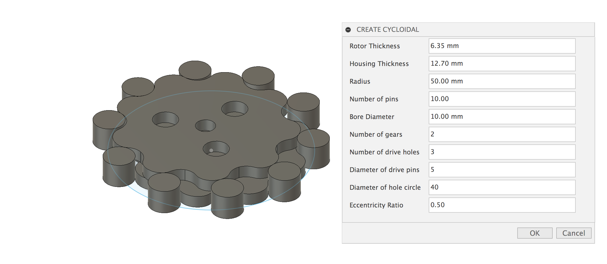

# Cycloidal Generator
A cycloidal reduction drive generator script for Fusion360! This same script is also merged with mawildoer/cycloidal_generator but I will add it here as well to make it easier to find. Credit to mawildoer for all the math and features behind the cycloidal shape.

Cycloidal reductions drives are basically a type of gearbox... but without gears per-say. They have little backlash meaning they're used in robots and machine tools. They have a really high ratio density and a high tooth engagement, meaning they're good for heaps of torque.
Here's the wiki: https://en.wikipedia.org/wiki/Cycloidal_drive

## How to:
You can install the script by clicking the "Add-ins" button in Fusion and navigating to the root folder of this directory. Click add then select it from the list and click run. A box will pop up and ask for all the parameters needed to create the gearbox.
